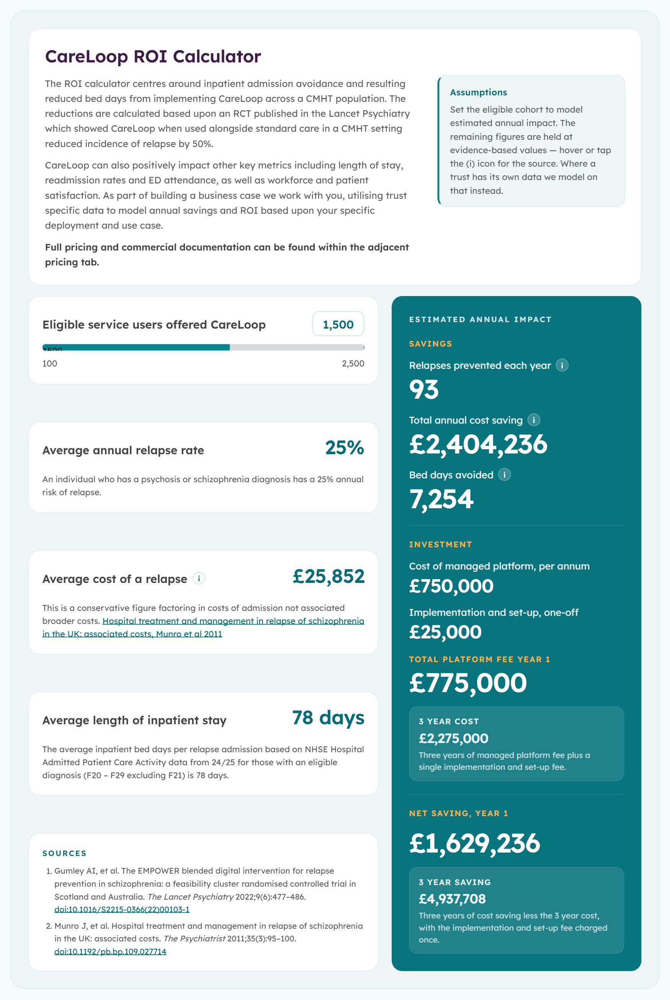

# CareLoop ROI Calculator

An interactive calculator that estimates the annual cost savings and return on investment (ROI) of deploying the CareLoop digital therapeutic across a community mental health team (CMHT) psychosis caseload — built for NHS/health-service finance, commissioning, or business-case-writing staff evaluating whether to fund the platform.

**Live demo:** https://hazzjc.github.io/DigitalTheraputicCostSavings/

## What it calculates

The user sets a single input — the number of eligible service users offered CareLoop (a slider from 100–2,500) — and the calculator models:

- **Relapses prevented per year** — eligible users × expected uptake × annual relapse rate × relapse-reduction rate, rounded down
- **Total annual cost saving** — relapses prevented × average cost of a relapse
- **Bed days avoided** — relapses prevented × average length of inpatient stay
- **Investment** — annual managed-platform fee plus a one-off implementation/set-up fee, shown for year 1 and over a 3-year contract
- **Net saving** — annual saving minus platform cost, for year 1 and over 3 years

Everything else — relapse rate, cost per relapse, length of stay, uptake, pricing, and contract length — is held at fixed, non-interactive values.

## Constraints and product decisions (as coded)

These are hardcoded in a `CONFIG` block at the bottom of `index.html`, not exposed as inputs:

| Constant | Value | Source cited in the app |
|---|---|---|
| Annual relapse rate | 25% | Stated as the annual risk of relapse for a psychosis/schizophrenia diagnosis (no citation given for this specific figure) |
| Relapse reduction from CareLoop | 50% | EMPOWER cluster-RCT, *The Lancet Psychiatry* 2022 (relative risk 0.50, 95% CI 0.26–0.98) |
| Expected uptake of eligible cohort | 50% | Not cited — appears to be a planning assumption, not tied to a source |
| Cost per relapse | £25,852 | Munro et al., *The Psychiatrist*, 2011 (mean UK in-patient cost per relapse admission; >97% hospital cost) |
| Average length of inpatient stay | 78 days | Cited to NHSE Hospital Admitted Patient Care Activity data, 2024/25, ICD-10 codes F20–F29 excluding F21 |
| Platform fee | £500 per eligible user/year | Not cited — a pricing assumption |
| Implementation/set-up fee | £25,000 one-off | Not cited — a pricing assumption |
| Contract length | 3 years | Drives the "3 year cost" / "3 year saving" figures |

None of these are user-configurable in the deployed page. The code comments say they are meant to be edited directly in the `CONFIG` object by whoever maintains the file, and the on-page copy states that for a real business case CareLoop works with a given trust to substitute trust-specific data.

## Architecture

This is a single self-contained static HTML file (`index.html`) — HTML, CSS and JavaScript (plus an inlined base64 webfont) all live in one document, with no build step, no framework, and no external network requests at runtime. It is designed to also be dropped into another site as an `<iframe>` (see the embed snippet in the HTML comments at the top of the file), and it `postMessage`s its height to a parent frame for auto-resizing embeds.

## Quality evidence

There are no automated tests, linting, or CI configured in this repository. The only verification performed for this README was manual: loading the live page in a browser, moving the slider, and confirming the displayed figures update and reconcile with the formulas in the script (see screenshot above).

## Setup

No build tooling or dependencies are required.

1. Clone the repo.
2. Open `index.html` directly in a browser, or serve the folder with any static file server (e.g. `npx serve .`).
3. To change pricing or modelling assumptions, edit the `CONFIG` object near the bottom of `index.html` — every on-screen figure, including the numbers written into the explanatory captions, is rendered from that block.

## Current limitations and status

- **No configurable inputs beyond cohort size.** All clinical and pricing assumptions are fixed in code (see table above); there is no UI for adjusting them without editing the HTML.
- **No tests or CI.**
- **Known housekeeping debt — duplicate HTML files.** The repository root contains four large, similar HTML files: `index.html`, `index-old.html`, `index2.html`, and `index3.html`, with no in-repo explanation of which is canonical.
  - `index.html` is confirmed to be the live, deployed file: GitHub Pages is configured to build from the `main` branch, root path (`/`), and Pages serves `index.html` at that path by default. Git history also shows `index.html` is the file that has been actively renamed into place and updated over time.
  - `index-old.html`, `index2.html`, and `index3.html` are earlier draft/iteration versions kept in the repository for reference — they are not served by GitHub Pages and are not referenced from `index.html`.
  - These files have **not** been removed as part of this documentation pass, since it isn't certain from the repository alone whether any are still needed for reference. A human should review and, if appropriate, delete the stale duplicates (or move them into an `archive/` folder) in a follow-up.

## Attribution and data provenance

- **Relapse-reduction figure (50%)** is attributed in the app to: Gumley AI, et al. "The EMPOWER blended digital intervention for relapse prevention in schizophrenia: a feasibility cluster randomised controlled trial in Scotland and Australia." *The Lancet Psychiatry* 2022;9(6):477–486. [doi:10.1016/S2215-0366(22)00103-1](https://doi.org/10.1016/S2215-0366(22)00103-1)
- **Cost-per-relapse figure (£25,852)** is attributed in the app to: Munro J, et al. "Hospital treatment and management in relapse of schizophrenia in the UK: associated costs." *The Psychiatrist* 2011;35(3):95–100. [doi:10.1192/pb.bp.109.027714](https://doi.org/10.1192/pb.bp.109.027714)
- **Length-of-stay figure (78 days)** is attributed in the app text to NHS England Hospital Admitted Patient Care Activity data, 2024/25, but no specific report or link is cited.
- **Annual relapse rate (25%), expected uptake (50%), and all pricing figures** (platform fee, implementation fee) have no cited source in the code or on the page — their provenance is undocumented.

### Licence

No licence file is present in this repository. In the absence of one, all rights are reserved by default — the code may not be reused, modified, or redistributed by others without permission from the repository owner.

## Housekeeping follow-up (for a human)

This README documents but does not resolve the duplicate-file situation described above. A recommended next step is for a human maintainer to confirm whether `index-old.html`, `index2.html`, and `index3.html` are still needed, then either delete them or relocate them out of the repository root (e.g. into `archive/`) so the root only contains the live `index.html`.
